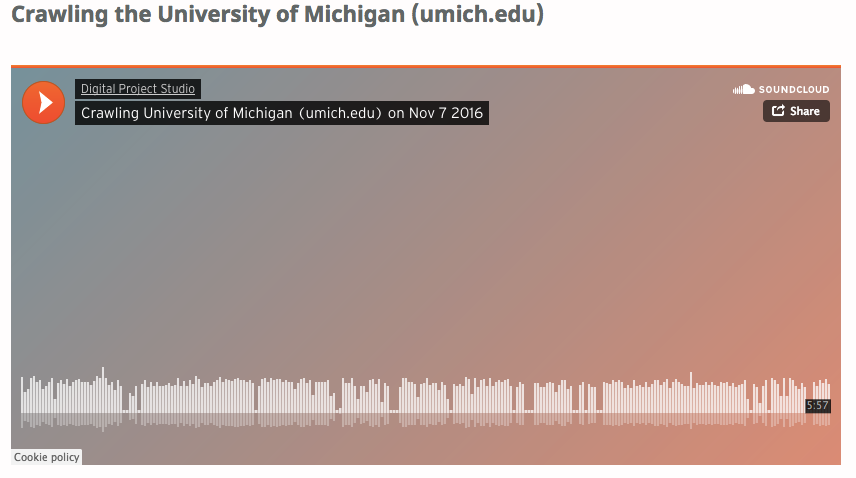

# [crawling_noise](https://github.com/clarkdatalabs/crawling_noise)
*Using the free and open-source SuperCollider software, this project generated music from web crawling information.*

"SuperCollider is free and open-source software that allows users to generate audio programmatically, including from messages sent over a local server. In our first project as data visualization interns, we used Python to crawl the web and collect parameters, which we passed to SuperCollider to generate music.

Within the Python portion of the project, we first supplied a starting web page (e.g. http://www.umich.edu) to begin crawling. Utilizing the Beautiful Soup Python library, the script recorded the following data about a starting web page to send as a message over a local server..." [More on Wordpress](https://digitalprojectstudio.wordpress.com/2016/11/11/listening-to-the-web-crawl-making-music-out-of-web-crawling-data-using-supercollider/#more-2518)

[View GitHub repository](https://github.com/clarkdatalabs/crawling_noise)
